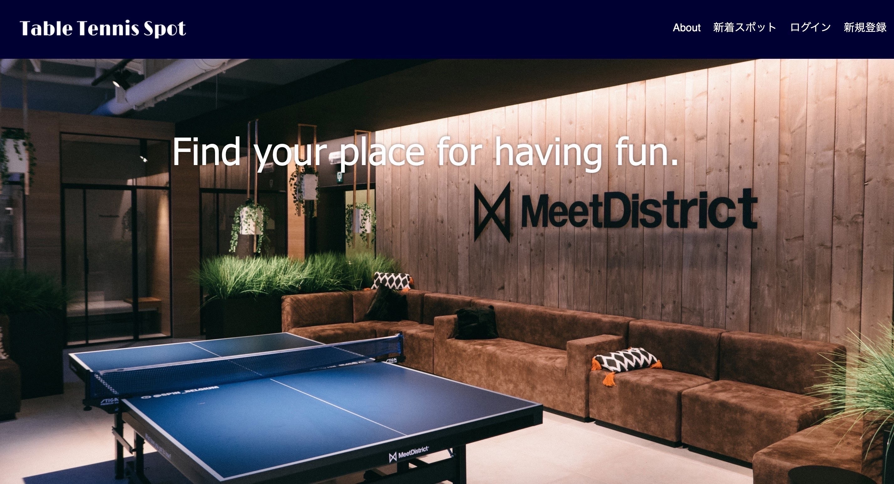
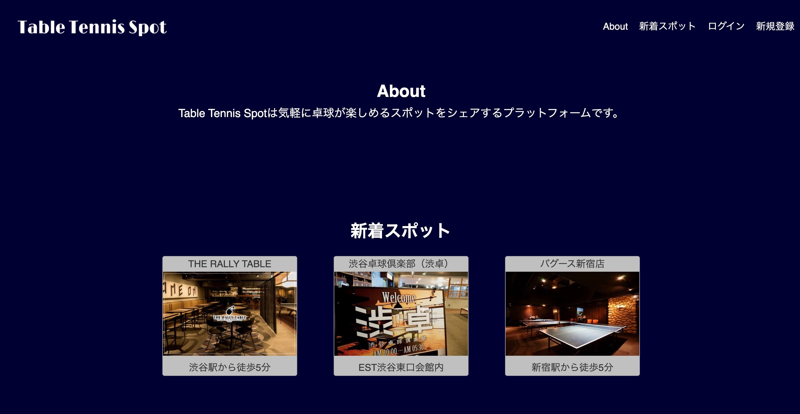

# Table Tennis Spot概要
Table Tennis Spotは、カジュアルに卓球が楽しめる場所を共有するアプリケーションです。

## 本番環境
https://ttspot.herokuapp.com/

## テストユーザー
メールアドレス： pingpong@gmail.com  
パスワード： test1234

# 制作した経緯
経験を問わず、気軽に卓球が楽しみたい人をユーザーとして想定し、このアプリを制作しました。  
私自身、卓球を中学の部活で経験したものの、ブランクが長く、「卓球はやりたいけどクラブに所属するほどではない・・」
という思いがあり、気軽に卓球を楽しめる場所を共有でき、更には似たようなレベル同士の人と繋がれたら楽しいだろうなという思いから、
このアプリの着想に至りました。

# 使用技術一覧
・Haml&Sass
・Ruby
・Ruby on Rails
・MySQL
・AWS
・Heroku

# 実装機能一覧
・ユーザー登録
・トップページ（新着投稿表示）
・スポット投稿
・スポット詳細表示

# 実装予定の機能
・投稿の編集・削除
・マイページ
・いいね機能
・投稿内容の充実（位置情報）
・ユーザー同士のグループ化

# DB設計

## usersテーブル
|Column|Type|Options|
|------|----|-------|
|name|string|null: false|
|email|string|null: false|
|password|string|null: false|

## postsテーブル
|Column|Type|Options|
|------|----|-------|
|name|string|null: false|
|content|text|null: false|

### Association
- has_many :images
- has_many :comments

## imagesテーブル
|Column|Type|Options|
|------|----|-------|
|img|string|null: false|
|post_id|integer|null: falsem foreign_key: true|
### Association
- belongs_to :post
